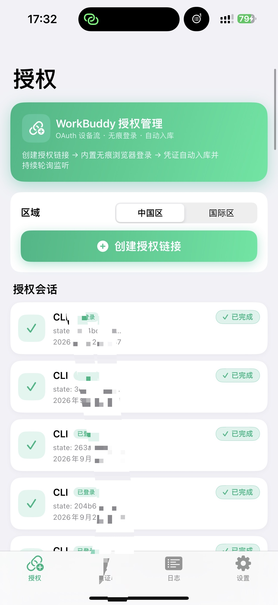
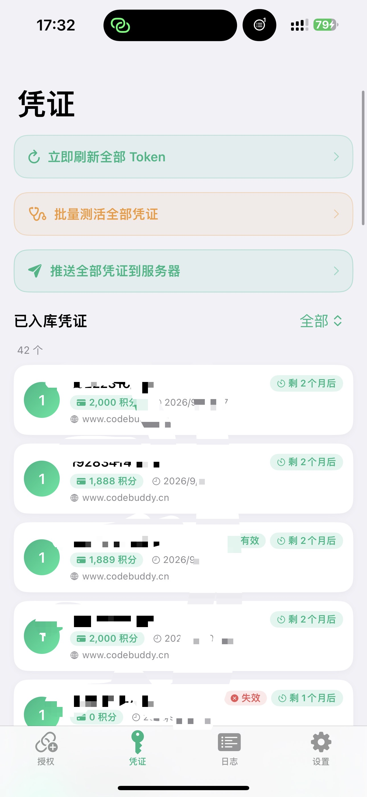
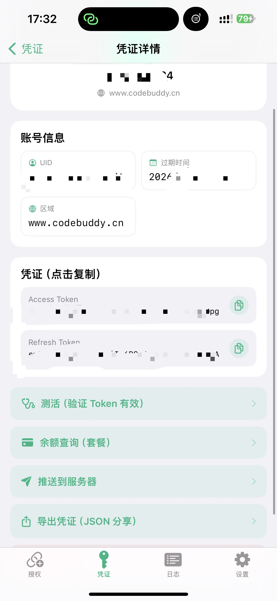

# BuddyKeyManager

> iOS WorkBuddy / CodeBuddy 账号授权密钥管理器（SwiftUI + WKWebView，iOS 16+）

一款运行在 iPhone 上的 **WorkBuddy/CodeBuddy OAuth 授权管理工具**：内置无痕浏览器完成登录授权、接入接码平台自动取号收验证码、管理多账号凭证（测活/余额/标注/筛选）、并一键推送凭证到自建的 Buddy2API 服务器入库。

适合批量管理 WorkBuddy / CodeBuddy 账号凭证的场景。

## 功能特性

### 🔐 授权登录
- 创建 OAuth 授权链接（`/v2/plugin/auth/state` 设备授权流）
- **内置无痕浏览器**（内存态 WKWebsiteDataStore，不落盘）
- 登录成功后**自动全量清除**浏览器数据（Cookie/localStorage/IndexedDB/WebSQL/ServiceWorker/缓存）
- 支持中国区 / 国际区切换

### 📱 接码自动登录（二选一）
- **ejiema 接码**：Token 取号 / 轮询取码 / 换号 / 余额
- **workbuddy 卡密**：浏览器快捷栏输入接码网址 → 自动 AES 加密卡密取号 → 填手机号 → 取码 → 填验证码
- **全自动模式**：无短信自动刷新换号，直到登录成功；后台运行 + 系统通知

### 💳 凭证管理
- 凭证列表：**测活状态**（有效/风控/失效）、**积分余额**、有效期、入库时间
- **批量测活** + **状态筛选**（有效/风控/失效/未测）
- 标注（备注）、长按删除、导出 JSON 分享
- Token 临近过期自动刷新

### ☁️ 推送入库
- 配置 Buddy2API 服务器地址 + 密码，一键把本地凭证推送入库（`/admin/account/import`）

## 界面预览

### 1. 授权会话（创建授权链接 + 无痕浏览器登录）

授权页展示 WorkBuddy OAuth 授权会话列表，每一条对应一个授权链接（`CLI` 平台 / 授权 state / 创建时间），点击进入内置无痕浏览器完成登录；登录成功后浏览器数据自动全量清除并跳转验证。



- **顶部**：WorkBuddy 品牌卡 + 区域切换（中国区/国际区）+ 创建授权链接
- **会话卡片**：状态图标（待登录/轮询中/已完成/失败）+ state + 创建时间
- 登录成功后凭证自动入库

### 2. 凭证列表（测活状态 + 积分余额 + 筛选）

凭证页集中展示已入库的所有 WorkBuddy 账号，每张卡片清晰标注健康状态与额度，支持按状态筛选。



- **测活状态徽章**：🟢 有效 / 🔴 失效 / 🟠 风控
- **积分余额**：💳 各账号剩余积分（缓存显示）
- **有效期 + 入库时间**：倒计时徽章与入库具体时间
- 顶栏可**批量测活 / 批量推送 / 状态筛选**（有效/风控/失效/未测）
- 长按卡片可标注 / 推送单个 / 删除

### 3. 凭证详情（Token 查看 + 测活 + 导出）

点击任一凭证进入详情页，可查看账号信息与 Access/Refresh Token，支持测活、余额查询、导出分享与推送入库。



- **账号卡**：头像 + 昵称 + 区域（domain）
- **Token 复制**：Access Token / Refresh Token 一键复制
- **操作**：测活（验证 Token 有效性）/ 余额查询（套餐明细）/ 推送服务器 / 导出 JSON / 删除

## 技术栈
- SwiftUI + WebKit（iOS 16+）
- OAuth 设备授权流（CodeBuddy `/v2/plugin/auth/*`）
- AES-128-CBC（接码卡密加密）
- 无需任何三方依赖 / CocoaPods / SPM

## 目录结构

```
BuddyKeyManager/
├── BuddyAuth.xcodeproj/       # Xcode 工程（未签名，需 TrollStore/自签/AltStore）
├── BuddyAuth/
│   ├── BuddyAuthApp.swift     # 入口
│   ├── ContentView.swift      # 主界面（授权/凭证/日志/设置）
│   ├── AuthModels.swift       # 数据模型（凭证/会话/响应）
│   ├── BuddyAPI.swift         # WorkBuddy OAuth 网络层
│   ├── CredentialStore.swift  # 凭证存储/测活/推送
│   ├── IncognitoWebView.swift # 无痕浏览器 + 登录页自动填充
│   ├── SmsBar.swift           # 接码快捷栏（取号/取码/换号）
│   ├── SmsAPI.swift           # ejiema 接码 API
│   ├── SvipxxSmsAPI.swift     # workbuddy 卡密接码 API（AES 加密）
│   ├── PushAPI.swift          # 推送凭证到 Buddy2API 服务器
│   ├── ProxySettings.swift    # 网络配置
│   ├── Theme.swift            # 设计系统
│   ├── Info.plist
│   └── Assets.xcassets/       # App 图标
└── build.json
```

## 编译

工程为**手写 Xcode 工程**（纯 SwiftUI，零三方依赖），可用 GitHub Actions macOS runner 编译为未签名 IPA，或用 Xcode 直接构建。

```bash
xcodebuild -project BuddyAuth.xcodeproj -scheme BuddyAuth \
  -configuration Release -sdk iphoneos \
  CODE_SIGNING_ALLOWED=NO archive -archivePath build/BuddyAuth.xcarchive
```

产物为**未签名 IPA**，可通过 **TrollStore / AltStore / Sideloadly / 自签** 安装。

## 使用说明

> ⚠️ 仅供个人账号管理，请遵守各平台服务条款。

1. **授权**：创建授权链接 → 内置无痕浏览器登录（QQ/微信/腾讯账号）→ 凭证自动入库
2. **接码**：设置页选择接码方式并填入凭据 → 浏览器快捷栏取号 → 自动填手机号 → 收到验证码自动填 → 登录
3. **凭证**：批量测活看健康度 → 筛选状态 → 标注/导出
4. **推送**：填好 Buddy2API 服务器，一键把凭证入库到服务器

### 隐私声明
- 所有 Token / 凭证仅存于本机 UserDefaults（App 沙盒）
- 服务器地址为运行时配置，代码不含真实服务器信息
- 不收集任何数据

## License
MIT
